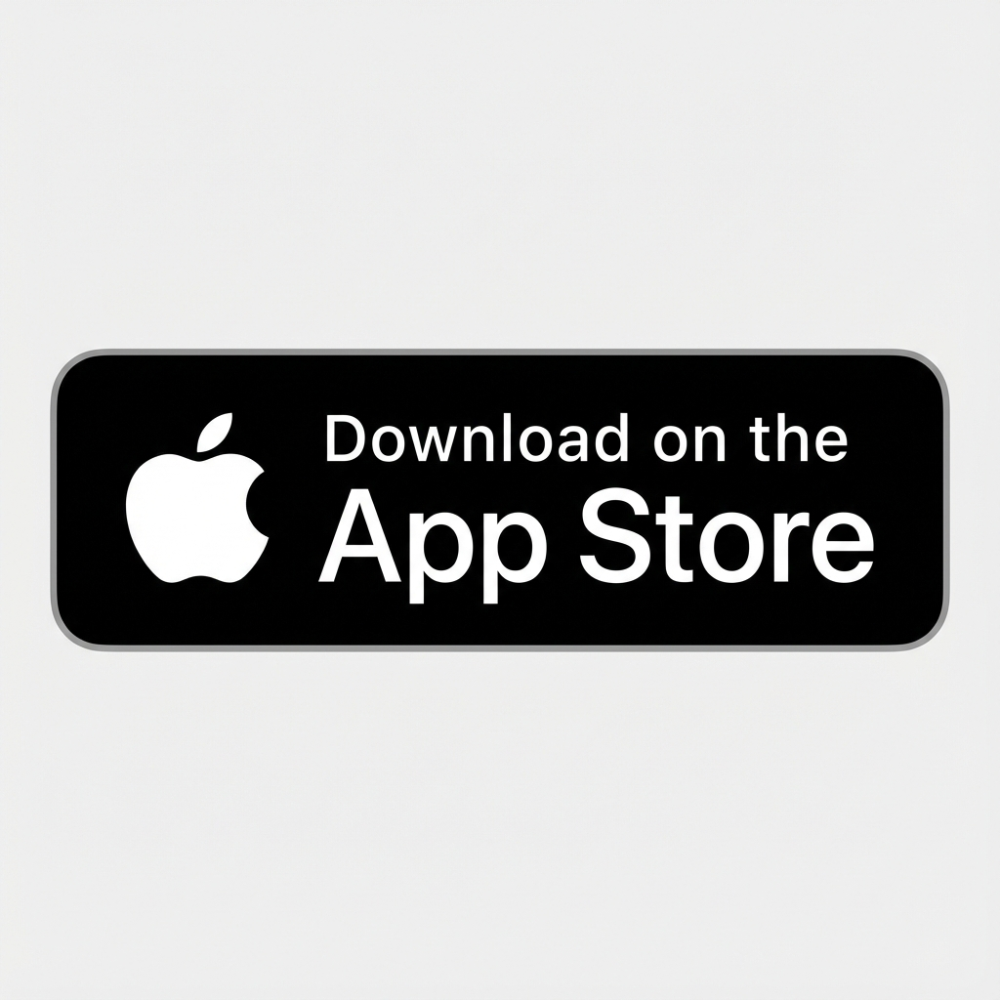

# Direct Download Button Setup Guide

## 📱 Overview

Your Ewave landing page now includes a **Direct Download Button** that automatically detects the user's device and provides the appropriate download experience:

- **Android/Desktop**: Downloads the APK file directly
- **iOS**: Shows a message directing users to the App Store

---

## 🔧 How It Works

### Device Detection

The JavaScript code automatically detects the user's device type:

```javascript
function detectDevice() {
    const userAgent = navigator.userAgent || navigator.vendor || window.opera;
    
    // Check for iOS devices (iPhone, iPad, iPod)
    if (/iPad|iPhone|iPod/.test(userAgent) && !window.MSStream) {
        return 'ios';
    }
    
    // Check for Android devices
    if (/android/i.test(userAgent)) {
        return 'android';
    }
    
    // Default to desktop
    return 'desktop';
}
```

### Download Behavior

#### On Android/Desktop:
1. User clicks "Download App" button
2. Button text changes to "Downloading..."
3. APK file download starts automatically
4. Success message appears: "✓ Download started! Check your downloads folder."
5. Button resets after 3 seconds

#### On iOS:
1. On page load, the download button is automatically hidden
2. iOS message is displayed instead:
   - "📱 Direct install is not supported on iPhone."
   - "Please use the App Store:"
   - App Store badge button (clickable)

---

## ⚙️ Configuration

### Update APK URL

**IMPORTANT**: You must replace the placeholder APK URL with your actual hosted APK file location.

**File**: `index.html` (around line 400)

**Find this line**:
```javascript
const apkUrl = 'https://yourdomain.com/downloads/ewave.apk';
```

**Replace with your actual URL**:
```javascript
const apkUrl = 'https://your-actual-domain.com/path/to/ewave.apk';
```

### Example APK Hosting Options:

1. **Your Own Server**:
   ```javascript
   const apkUrl = 'https://ewave.app/downloads/ewave-v1.0.apk';
   ```

2. **GitHub Releases**:
   ```javascript
   const apkUrl = 'https://github.com/yourusername/ewave/releases/download/v1.0/ewave.apk';
   ```

3. **Firebase Storage**:
   ```javascript
   const apkUrl = 'https://firebasestorage.googleapis.com/v0/b/your-bucket/o/ewave.apk?alt=media';
   ```

4. **Google Drive** (Public Link):
   ```javascript
   const apkUrl = 'https://drive.google.com/uc?export=download&id=YOUR_FILE_ID';
   ```

---

## 🎨 UI Elements

### Download Button
- **Text**: "Download App"
- **Style**: Sky blue to cyan gradient (matches your app theme)
- **Subtext**: "Free • Works Offline • No Login"

### iOS Message Box
- **Background**: Semi-transparent white with blur effect
- **Content**: 
  - Emoji indicator (📱)
  - Explanation text
  - App Store badge button

### Download Status
- **Success**: Green checkmark with message
- **Loading**: "Downloading..." text on button

---

## 🧪 Testing

### Test on Desktop (Chrome/Edge)
1. Open the landing page
2. Click "Download App" button
3. **Expected**: APK download should start
4. **Verify**: Check your Downloads folder

### Test on Android Device
1. Open the landing page on Android phone
2. Click "Download App" button
3. **Expected**: APK download should start
4. **Verify**: Check notification bar for download

### Test on iOS Device (iPhone/iPad)
1. Open the landing page on iOS device
2. **Expected**: 
   - Download button should be hidden automatically
   - iOS message should be visible
   - App Store badge should be clickable

### Test with Browser DevTools
1. Open Chrome DevTools (F12)
2. Click the device toolbar icon (Ctrl+Shift+M)
3. Select different devices from the dropdown
4. Refresh the page to test device detection

---

## 📋 Code Structure

### HTML Elements

```html
<!-- Download Button -->
<button id="downloadBtn" class="btn btn-primary btn-large" onclick="handleDownload()">
    <span id="btnText">Download App</span>
</button>
<p class="download-subtext">Free • Works Offline • No Login</p>

<!-- iOS Message (hidden by default) -->
<div id="iosMessage" class="ios-message" style="display: none;">
    <p>📱 Direct install is not supported on iPhone.</p>
    <p>Please use the App Store:</p>
    <a href="https://apps.apple.com/app/Ewave" class="store-btn-small">
        
    </a>
</div>

<!-- Download Status Message -->
<p id="downloadStatus" class="download-status"></p>
```

### JavaScript Functions

1. **`detectDevice()`**: Returns 'ios', 'android', or 'desktop'
2. **`handleDownload()`**: Manages the download process
3. **`DOMContentLoaded` listener**: Auto-detects iOS on page load

### CSS Classes

- `.download-subtext`: Styles for the subtext below the button
- `.ios-message`: Styles for the iOS message container
- `.download-status`: Styles for success/error messages
- `.btn-primary:disabled`: Styles for disabled button state

---

## 🔒 Security Considerations

### HTTPS Required
- Your APK file **must** be hosted on HTTPS
- Modern browsers block downloads from HTTP sources

### CORS Headers
If hosting on a different domain, ensure proper CORS headers:
```
Access-Control-Allow-Origin: *
Access-Control-Allow-Methods: GET
```

### File Integrity
Consider adding a checksum or hash for users to verify:
```html
<p class="download-subtext">
    Free • Works Offline • No Login<br>
    <small>SHA256: abc123...</small>
</p>
```

---

## 🚀 Deployment Checklist

Before going live:

- [ ] Replace placeholder APK URL with actual hosted APK
- [ ] Test download on Android device
- [ ] Test iOS message display on iPhone
- [ ] Test on desktop browsers (Chrome, Edge, Firefox)
- [ ] Verify APK file is accessible via HTTPS
- [ ] Update App Store URL if different from placeholder
- [ ] Test with slow internet connection
- [ ] Verify file size is reasonable for mobile download
- [ ] Add version number to APK filename (e.g., `ewave-v1.0.apk`)
- [ ] Consider adding a changelog or release notes link

---

## 📱 APK Hosting Best Practices

### File Naming
Use descriptive, versioned filenames:
- ✅ `ewave-v1.0.0.apk`
- ✅ `ewave-release-1.0.apk`
- ❌ `app.apk`
- ❌ `download.apk`

### File Size
- Keep APK size under 50MB for better mobile download experience
- Consider offering a "lite" version if app is large

### Version Management
- Update the APK URL when releasing new versions
- Consider adding version detection to prompt updates

---

## 🛠️ Troubleshooting

### Download doesn't start
- **Check**: Is the APK URL correct?
- **Check**: Is the file accessible via HTTPS?
- **Check**: Browser console for errors (F12)

### iOS users see download button
- **Check**: Device detection regex in JavaScript
- **Check**: Browser user agent string
- **Solution**: Clear cache and hard refresh (Cmd+Shift+R)

### Button stays in "Downloading..." state
- **Check**: Network tab in DevTools
- **Check**: APK file exists at the specified URL
- **Solution**: The timeout will reset it after 3 seconds

### Download works but file is corrupted
- **Check**: APK file integrity on server
- **Check**: MIME type is set correctly (`application/vnd.android.package-archive`)
- **Solution**: Re-upload APK file

---

## 📞 Support

For issues with the landing page download button:
1. Check browser console for JavaScript errors
2. Verify APK URL is accessible
3. Test on multiple devices/browsers
4. Check server logs for download requests

---

## 🎯 Future Enhancements

Consider adding:
- Download progress indicator
- File size display
- Version number display
- Automatic update checker
- QR code for easy mobile download
- Download analytics tracking

---

**Last Updated**: 2025-12-17
**Version**: 1.0
**Compatibility**: Chrome, Edge, Firefox, Safari (iOS message), Mobile browsers
